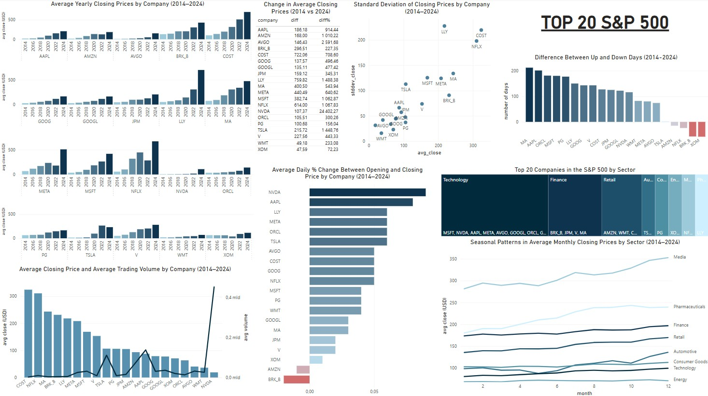
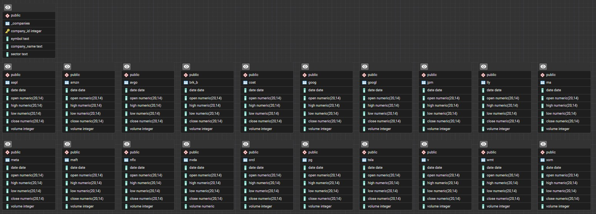

# sp500-top20-analysis  
Analiza danych giełdowych 20 największych spółek z indeksu S&P 500 (2014–2024) przy użyciu PostgreSQL i Power BI  

**ENGLISH BELOW**

---

## Dashboard Power BI  

Projekt zawiera **interaktywny dashboard** stworzony w Power BI, który umożliwia eksplorację danych za pomocą filtrów i dynamicznych wizualizacji.  
Model danych został zbudowany na podstawie widoków zaimportowanych z bazy PostgreSQL, gdzie kluczowym elementem jest symbol spółki.  
W razie potrzeby tworzono dodatkowe kolumny i miary w celu ułatwienia analizy oraz lepszego zobrazowania danych w raportach.  
Dzięki temu możliwe jest szybkie filtrowanie i szczegółowa analiza danych wybranej firmy.

---

## Struktura bazy danych  

Projekt opiera się na bazie danych PostgreSQL, zawierającej dane giełdowe dla 20 największych spółek z indeksu S&P 500 (łącznie 21 tabel – jedna główna oraz po jednej dla każdej spółki).  
Dane obejmują lata 2014–2024, a baza została zaprojektowana w PostgreSQL i zawiera następujące tabele:

Projekt zawiera szereg funkcji i widoków, które umożliwiają analizę danych giełdowych w Power BI w celu wizualizacji oraz wyciągania wniosków.

---

## Technologie i narzędzia

- **PostgreSQL** – relacyjna baza danych: przechowywanie, przetwarzanie danych, tworzenie zapytań analitycznych, funkcji i widoków  
- **Power BI** – interaktywny dashboard, model danych, dodatkowe kolumny i miary, końcowa prezentacja wyników  
- **PyCharm** – środowisko pracy z danymi i zarządzania kodem  
- **CSV** – format danych źródłowych  

---

## Struktura folderów

- `sql/` – zapytania SQL  
- `data/` – dane źródłowe CSV  
- `power_bi/` – dashboard (.pbix)  
- `img/` – dashboard Power BI, schemat ERD  
- `README.md` – opis projektu  

---

## Autor

Projekt edukacyjny łączący analizę danych, pracę w PostgreSQL oraz tworzenie interaktywnych wizualizacji w Power BI.

---

## Źródła 

Dane giełdowe pobrano z serwisu [Stooq](https://stooq.pl/).

---
---

# sp500-top20-analysis  
Stock market data analysis of the 20 largest companies in the S&P 500 index (2014–2024) using PostgreSQL and Power BI  

---

## Power BI Dashboard  

The project features an **interactive dashboard** built in Power BI, allowing users to explore data through filters and dynamic visualizations.  
The data model is based on views imported from a PostgreSQL database, where the company symbol is the key element.  
Additional columns and measures were created when necessary to simplify analysis and enhance data presentation in the reports.  
As a result, users can easily filter and perform in-depth analysis of a selected company.

---

## Database Structure  

The project is based on a PostgreSQL database containing stock market data for the 20 largest companies in the S&P 500 index (21 tables in total – one main table and one per company).  
The dataset covers the years 2014–2024. The database was designed in PostgreSQL and includes the following tables:

The project also includes several functions and views that enable data analysis in Power BI, allowing for effective visualization and insights.

---

## Technologies & Tools  

- **PostgreSQL** – relational database for storing and processing data, creating analytical queries, functions, and views  
- **Power BI** – interactive dashboard, data modeling, additional columns and measures, final presentation of results  
- **PyCharm** – data development and code management environment  
- **CSV** – source data format  

---

## Folder Structure  

- `sql/` – SQL queries  
- `data/` – source CSV files  
- `power_bi/` – dashboard file (.pbix)  
- `img/` – Power BI dashboard, ERD diagram  
- `README.md` – project description  

---

## Author  

An educational project combining data analysis, work in PostgreSQL, and the creation of interactive visualizations in Power BI.

---

## Sources

Stock market data taken from [Stooq](https://stooq.pl/).

